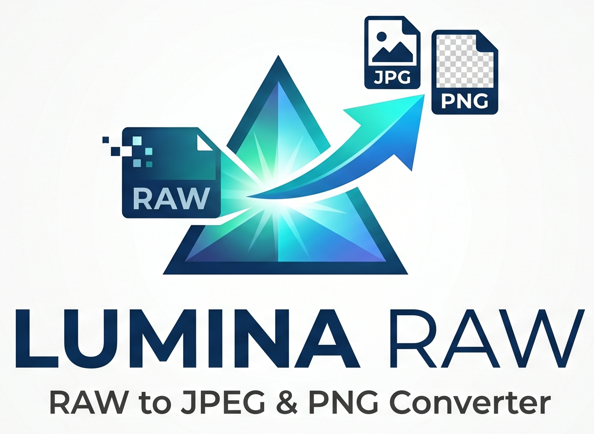

# Lumina RAW - Premium RAW Conversion Engine



Lumina RAW is a professional-grade desktop application built with Tauri and React, designed for photographers who need fast, reliable, and high-fidelity conversion of RAW images to JPEG or PNG.

## ✨ Key Features

- **🚀 Native Performance**: Built on the Tauri v2 framework for a lightweight, lightning-fast native Windows experience with Mica transparency effects.
- **🛡️ Zero-Dependency Extraction**: Features a custom "In-App" binary parser that extracts full-resolution JPEG previews directly from RAW files, bypassing corrupt system codecs and buggy ImageMagick delegates.
- **🧠 Intelligence Engine**: Automatically detects camera brands (Nikon, Canon, Sony, Fuji, etc.) and optimizes conversion parameters without user input.
- **🌓 Premium Aesthetics**: A state-of-the-art "Command Center" UI with dark mode, fluid Framer Motion animations, and a focus on visual excellence.
- **🔄 Dual Conversion Modes**:
    - **Local Mode**: Process entire folders directly on your machine.
    - **Upload Mode**: Drag-and-drop workflow for fast, single-file processing with real-time progress tracking.
- **📂 Robust File Handling**: Integrated PowerShell-based folder picker for seamless directory selection on Windows.

## 🛠️ Technology Stack

- **Frontend**: React 18, Vite, Tailwind CSS, Framer Motion
- **Native Bridge**: Tauri v2 (Rust)
- **Backend Services**: Node.js, Express (Internal process management)
- **Core Processing**: Custom Binary Extractor, WIC (Windows Imaging Component), and ImageMagick fallback.

## 🚀 Getting Started

### Prerequisites
- [Node.js](https://nodejs.org/) (v18+)
- [Rust](https://rustup.rs/) (For Tauri native compilation)
- [ImageMagick](https://imagemagick.org/) (Recommended for legacy format support)

### Development
1. Clone the repository
2. Install dependencies:
   ```bash
   npm install
   ```
3. Start the development environment (Backend + Frontend + Tauri):
   ```bash
   npm run tauri dev
   ```

### Building for Production
To generate a standalone Windows installer (.msi / .exe):
```bash
npm run tauri build
```

## 📜 License
This project is proprietary and built for professional photography workflows.
